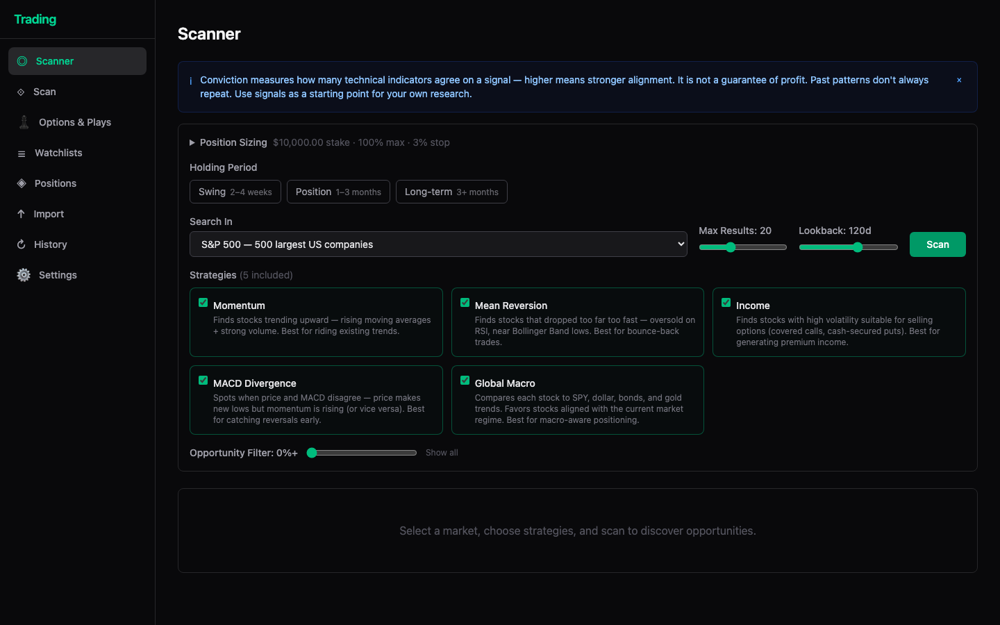
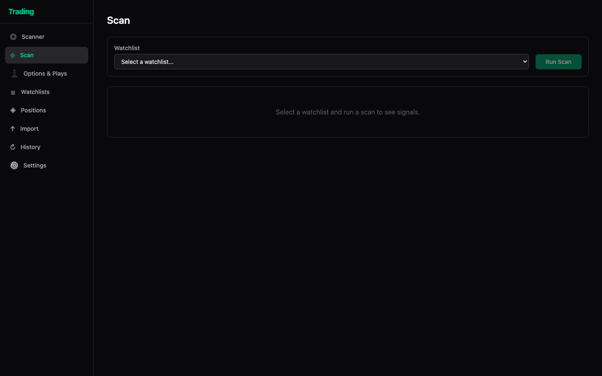
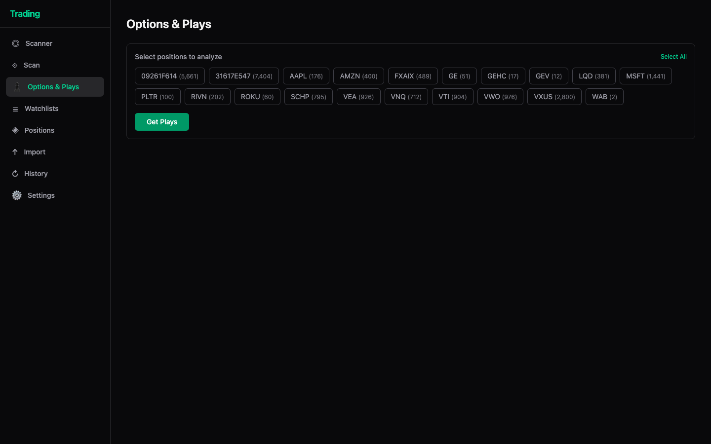
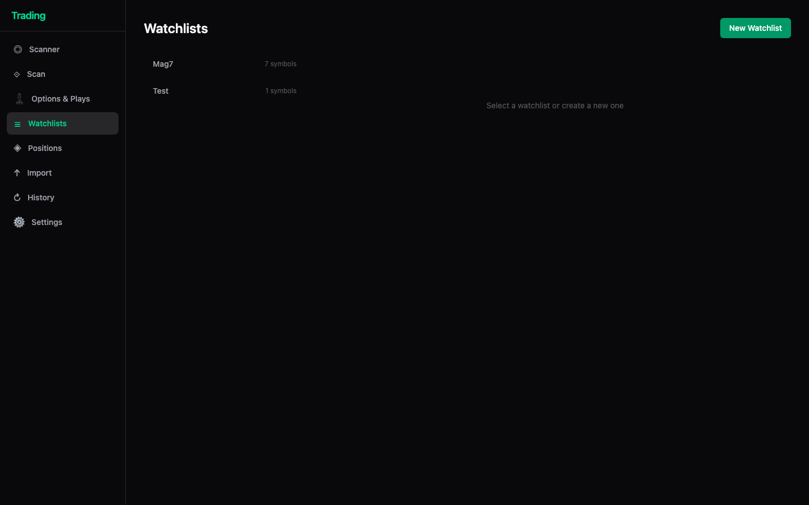
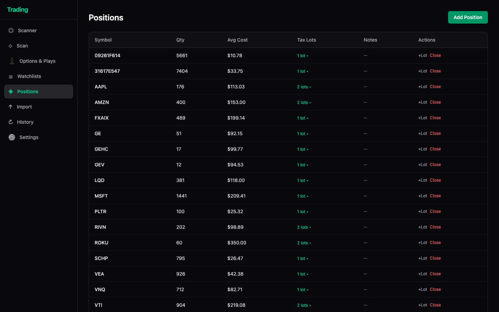
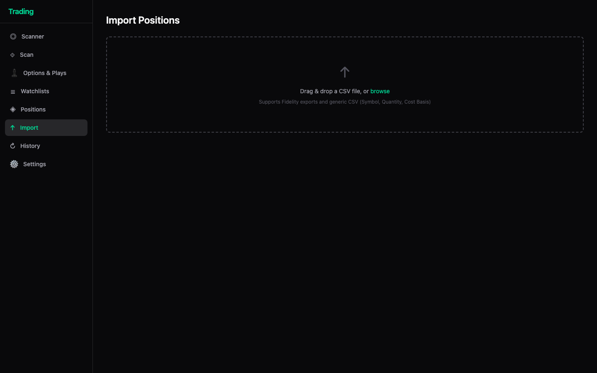
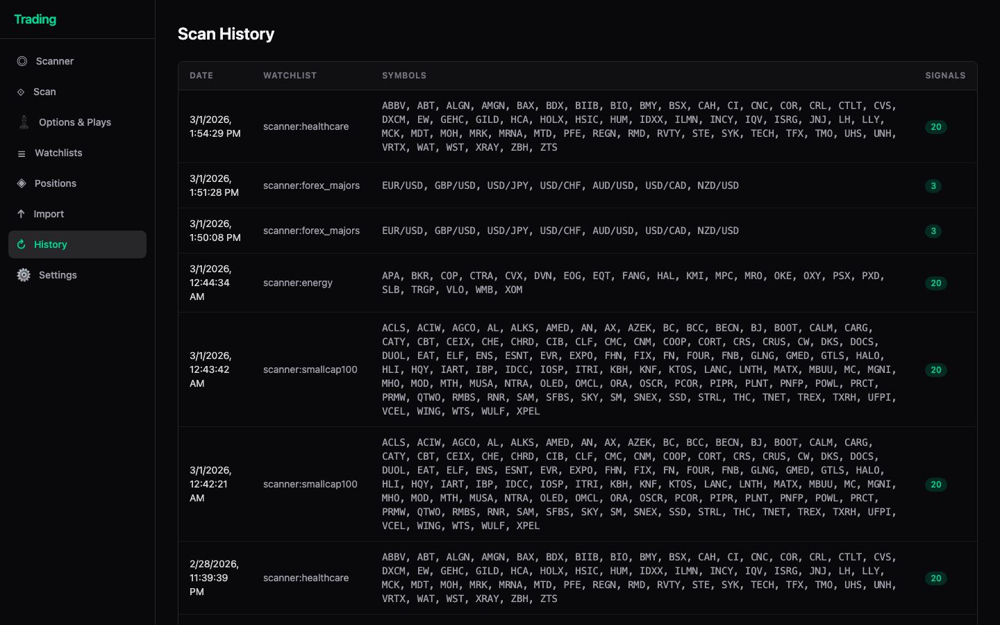
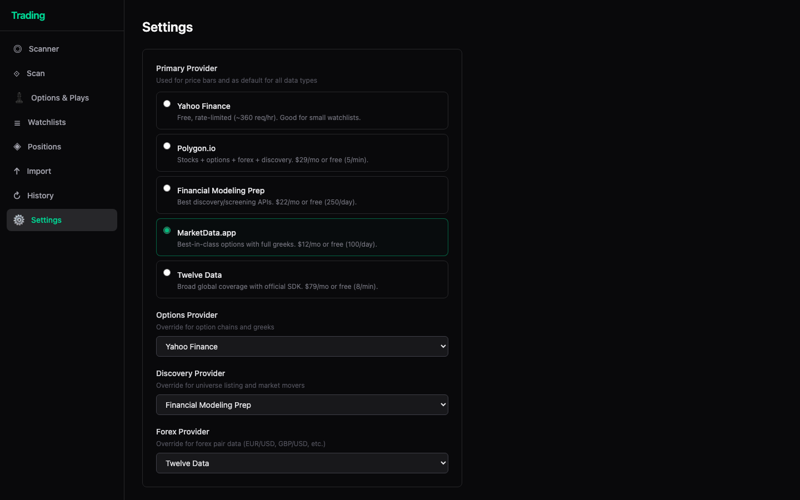

# Dashboard

The Trading dashboard is a React frontend (port 5173 in dev, port 9000 in production) for running scans, managing watchlists, tracking positions, and generating trade playbooks.

---

## Navigation

The sidebar has eight pages:

| Page | What it's for |
|---|---|
| **Scanner** | Scan large market universes for signals |
| **Scan** | Quick scan against a saved watchlist |
| **Options & Plays** | Generate trade playbooks for your positions |
| **Watchlists** | Create and manage symbol watchlists |
| **Positions** | Track your portfolio with tax lot detail |
| **Import** | Bulk-import positions from a CSV file |
| **History** | Log of every past scan run |
| **Settings** | Configure data providers |

---

## Scanner



The main discovery page. Searches a broad universe of symbols and returns the best opportunities ranked by conviction.

**Controls:**

| Control | Description |
|---|---|
| **Search In** | Market universe to scan — indices (S&P 500, NASDAQ 100, Dow 30, Small-Cap 100), sectors (Technology, Healthcare, Financials, etc.), Forex Majors, trending lists (Top Gainers/Losers/Most Active), or a custom symbol list |
| **Holding Period** | Filters signals by time horizon — Swing (2–4 weeks), Position (1–3 months), or Long-term (3+ months) |
| **Max Results** | Cap on number of signals returned (slider) |
| **Lookback** | Days of price history used by strategies (slider, default 120d) |
| **Strategies** | Toggle any combination of the five strategies below |
| **Opportunity Filter** | Minimum conviction % — slide right to show only high-conviction signals |

**Strategies:**

| Strategy | What it finds |
|---|---|
| **Momentum** | Stocks trending upward — rising moving averages + strong volume |
| **Mean Reversion** | Oversold stocks near Bollinger Band lows, good for bounce-back trades |
| **Income** | High-volatility stocks suitable for covered calls and cash-secured puts |
| **MACD Divergence** | Price/MACD disagreements that signal early reversals |
| **Global Macro** | Stocks aligned with current SPY, dollar, bond, and gold trends |

> **Conviction** measures how many technical indicators agree — higher means stronger alignment. It is not a guarantee of profit.

After clicking **Scan**, results stream in live. Click any row to open a detailed playbook panel. Signals can be saved directly to a watchlist via the row action menu.

**Position Sizing** (collapsible at top): shows the current stake, max position %, and stop-loss % from Settings. These values are used to size every recommendation.

---

## Scan



A quick scan scoped to one of your saved watchlists rather than a full market universe.

1. Select a watchlist from the dropdown.
2. Click **Run Scan**.
3. Results appear in the signal table — same format as Scanner.

Use this when you want to monitor a curated list of symbols you already follow.

---

## Options & Plays



Generates step-by-step trade playbooks for positions you already hold.

1. Select one or more positions (each chip shows symbol and share count).
2. Click **Get Plays**.
3. The system calls the AI advisor and returns a playbook for each position — entry/exit instructions, risk scenarios, and stop-loss levels.

Use **Select All** to analyze your entire portfolio at once.

---

## Watchlists



Named lists of ticker symbols used by the **Scan** page and the Scanner's "save to watchlist" action.

- Click **New Watchlist** to create one.
- Click a watchlist name to select it and edit its symbols.
- Symbols can be added one-by-one or as a comma-separated list.
- Watchlists are also surfaced as scan targets in the **Scan** page dropdown.

---

## Positions



A portfolio ledger showing everything you currently hold.

**Columns:**

| Column | Description |
|---|---|
| **Symbol** | Ticker (stocks, ETFs, mutual funds, bonds) |
| **Qty** | Total shares/units held |
| **Avg Cost** | Average cost basis per share across all lots |
| **Tax Lots** | Number of lots — click to expand and see individual purchase dates and prices |
| **Notes** | Free-text field per position |
| **Actions** | **+Lot** to add a new tax lot; **Close** to mark the position closed |

Click **Add Position** (top right) to enter a new holding manually. Positions are also populated via the **Import** page.

---

## Import



Bulk-import positions from a broker CSV export.

- Drag & drop a CSV file onto the upload area, or click **browse** to select one.
- Supports **Fidelity exports** and any **generic CSV** with columns: Symbol, Quantity, Cost Basis.
- After upload, a preview table shows each row with status (new, duplicate, or warning).
- Click **Commit** to save the valid rows to your Positions.

---

## Scan History



An automatic log of every scan you've run.

**Columns:**

| Column | Description |
|---|---|
| **Date** | Timestamp of the scan |
| **Watchlist** | Universe or watchlist scanned (e.g. `scanner:healthcare`, `scanner:forex_majors`) |
| **Symbols** | All symbols that were evaluated |
| **Signals** | Count of signals returned (green badge) |

Click any row to re-open the full signal results for that scan.

---

## Settings



Configures which data providers the system uses for different data types.

**Primary Provider** — used for price bars and as the default for all data types:

| Provider | Notes |
|---|---|
| **Yahoo Finance** | Free, rate-limited (~360 req/hr). Good for small watchlists. |
| **Polygon.io** | Stocks + options + forex + discovery. $29/mo or free (5/min). |
| **Financial Modeling Prep** | Best discovery/screening APIs. $22/mo or free (250/day). |
| **MarketData.app** | Best-in-class options with full greeks. $12/mo or free (100/day). |
| **Twelve Data** | Broad global coverage with official SDK. $79/mo or free (8/min). |

**Specialty overrides** — independent provider selection for specific data types:

| Override | Purpose |
|---|---|
| **Options Provider** | Option chains and greeks |
| **Discovery Provider** | Universe listing and market movers |
| **Forex Provider** | EUR/USD, GBP/USD, etc. |

API keys for paid providers are stored in `config.toml` (never committed to source control). See `config.example.toml` for the key names.

---

## API

The backend exposes a REST API at port 9000. Interactive docs are available at:

```
http://localhost:9000/docs
```

Key endpoints:

| Method | Path | Description |
|---|---|---|
| GET | `/api/config` | Current config (stake, strategies, providers) |
| GET | `/api/watchlists` | List all watchlists |
| POST | `/api/scanner/run-stream` | Run a scanner scan (SSE stream) |
| POST | `/api/scans` | Run a watchlist scan |
| GET | `/api/positions` | List all positions |
| POST | `/api/advise` | Generate a trade playbook |
| POST | `/api/import/preview` | Preview a CSV import |
| POST | `/api/import/commit` | Commit a CSV import |
| GET | `/api/diagnostics/health` | Health check |
| GET | `/api/diagnostics/providers` | Provider connectivity status |
